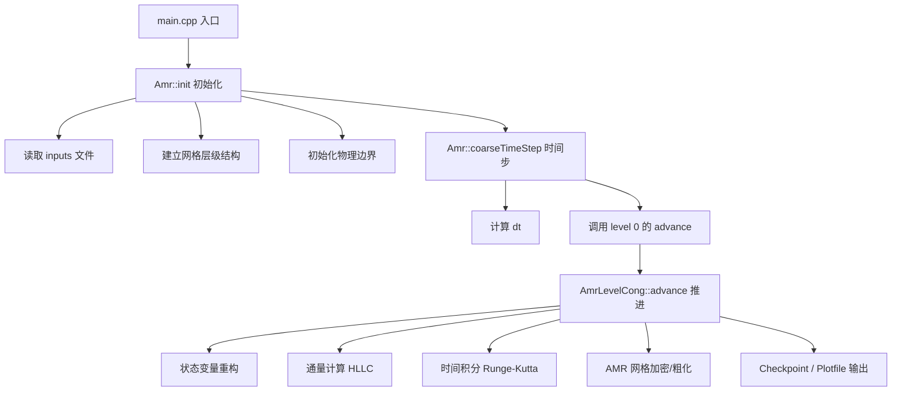
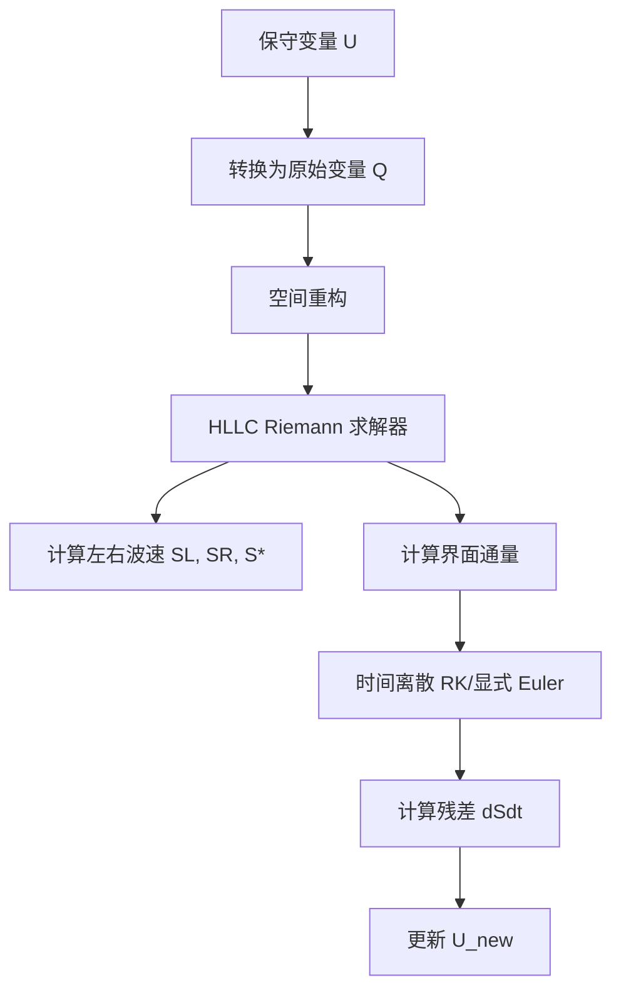

# 项目分析：双相流CFD求解器

## 项目总览

这是一个基于 **AMReX** 框架的 **双相流（Two-Phase Flow）数值求解器**，用于模拟可压缩两相流体动力学问题。

### 核心物理模型
该项目求解**可压缩双流体模型（Compressible Two-Fluid Model）**，包含以下守恒变量：

| 变量索引 | 名称 | 物理意义 |
|---------|------|----------|
| AlphaRho1 | $\alpha_1 \rho_1$ | 相1（体积分数×密度） |
| AlphaRho2 | $\alpha_2 \rho_2$ | 相2（体积分数×密度） |
| XMom/YMom | $\rho u, \rho v$ | 动量分量 |
| Energy | $\rho E$ | 总能量 |
| Alpha1 | $\alpha_1$ | 相1体积分数 |

## 代码架构

```
项目根目录/
├── main.cpp                 # 主程序入口
├── CmakeLists.txt          # CMake构建配置
├── 2phase/                 # 两相流方程模块
│   ├── equation.H          # 状态方程（EOS）
│   ├── eigen_system.cpp    # 特征系统
│   ├── deriv_usr.H         # 通量计算（HLLC）
│   └── variable_set.cpp    # 变量定义
├── deriv/                  # 通量项基类
│   └── deriv.H             # 一阶导数项模板
├── amrex_level_Cong/        # AMR级别定义
│   ├── AmrLevelCong.H      # 类声明
│   ├── AmrLevelCong_advance.cpp  # 时间推进
│   └── output_tmp.H        # 输出处理
└── reconstruction_scheme/  # 重构格式
    └── positive_preserving.cpp  # 保正重构
```

## 程序执行流程



## 核心数值方法流程



## 双相流特征值结构


## 建议的数据可视化图表

### 1. 网格结构图

```
Level 0:    ┌────┬────┬────┬────┐
            │    │    │    │    │
            └────┴────┴────┴────┘

Level 1:    ┌──┬──┬┌──┬──┐
            │  │  ││  │  │
            ├──┼──┼┼──┼──┤
            │  │  ││  │  │
            └──┴──┘└──┴──┘
```

### 2. 变量分布图（建议绘制）
- **密度等值线图** ($\rho_1$, $\rho_2$)
- **体积分数分布** ($\alpha_1$, $\alpha_2$)
- **压力场分布** ($p$)
- **速度矢量场** ($\vec{u}$)
- **网格加密图** (显示 AMR 层级分布)

### 3. 初始条件/算例配置
参考 `data/inputs2phase2d` 中的配置：
- 激波管问题 (Shock Tube)
- 界面问题 (Interface Problem)
- Riemann 问题

## 快速上手建议

1. **先读 `inputs2phase2d`** - 了解运行参数格式
2. **看 `main.cpp`** - 理解程序整体流程
3. **看 `AmrLevelCong_advance.cpp`** - 核心时间推进
4. **看 `equation.H`** - 理解状态方程
5. **运行一个简单算例** - 从 2D 激波管开始

## 代码文件说明

### 核心文件
- **main.cpp**: 程序入口，包含主循环和AMR初始化
- **AmrLevelCong_advance.cpp**: 时间推进的核心实现
- **equation.H**: 状态方程和物理模型
- **deriv_usr.H**: HLLC Riemann 求解器实现

### 配置文件
- **inputs2phase1d**: 1D双相流算例配置
- **inputs2phase2d**: 2D双相流算例配置
- **inputs2phase2dMach10**: 高速流动算例配置

## 技术特点

1. **自适应网格加密 (AMR)**: 基于误差估计自动调整网格分辨率
2. **HLLC Riemann 求解器**: 准确捕捉激波和界面
3. **保正重构**: 确保物理量（密度、体积分数）非负
4. **并行计算**: 利用AMReX的并行框架
5. **多维度支持**: 可处理1D和2D问题

## 运行说明

### 编译
```bash
cd build
cmake ..
make
```

### 运行
```bash
./twoPhaseSolver inputs2phase2d
```

### 结果分析
- 检查 `plt*` 目录中的可视化文件
- 使用 ParaView 或 VisIt 查看结果
- 检查 `chk*` 目录中的 checkpoint 文件

## 注意事项

1. **计算资源**: 2D问题可能需要较大的内存
2. **参数调整**: 根据具体问题调整 CFL 数和网格加密参数
3. **初始条件**: 合理设置初始条件以避免数值不稳定
4. **边界条件**: 确保边界条件与物理问题匹配

## 未来扩展方向

1. **三维问题**: 扩展到3D双相流模拟
2. **多相流模型**: 考虑更多相的情况
3. **湍流模型**: 加入湍流封闭模型
4. **化学反应**: 考虑燃烧等化学反应
5. **GPU加速**: 充分利用GPU并行计算能力